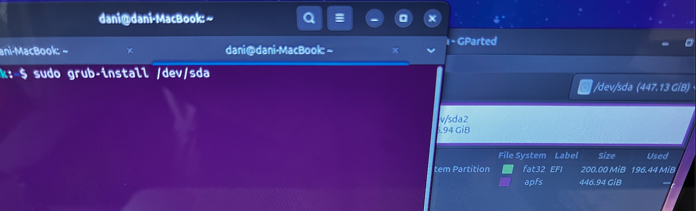

# Restore GRUB

To put you a bit in context, I decided to give my old MacBook Pro Late 2011 a new life by installing Ubuntu natively in one of the 2 hard drives. Almost 1 year after buying my MacBook, I decided to exchange the internal DVD drive for a second HDD. In that slot, years later I switched from HDD so SSD.
Other upgrades I made on my old MacBook Pro was upgrade from 4 Gb of RAM to 16 Gb, changed the fan (was too noisy after 10 years running almost every day), changed the speakers and the thermal paste. And after all this years it's still running like the first day. The reason I decided to keep this MacBook Pro, was due to the Intel Chip, thanks to it I'm still able to create home labs in VirtualBox or learning Networking using GNS3, or installing older Windows versions to practice Pentesting, things that today, at least for now March 2025, still does not work as smooth as it should on Mac with Apple Chips.

After installing Ubuntu, my MacBook Pro always booted up with that operative system, but after trying to enter to the hard drive under I had installed MAC OS Big Sur, the Grub failed.
On every restart, it was showing the image below and I was not able to enter to Ubuntu.


By clicking on the EFI image, I was prompted with a terminal console showing Grub 2.12.


In order to check all available partitions on that hard drive, I used the listing command ```ls```.
After doing so, I was able to see several partitions: ```(hd0) (hd1) (hd2) ... (hd8,gpt2)```

Seems that the correct partition was ```(hd8,gpt2)```, as it was the only one showing folders like ```boot/```, ```/sys```, ```/usr```, ...


To be absolute sure, played around with the ```ls```command till I found the folder with the 4 latest Virtual Machines I installed in the past 2 weeks for my Pentesting lab, under ```ls (hd8,gpt2)/usr/dani/VirtualBox VMs```.

After identifying the correct partition, it was time to fix it proceeding as follows:

- ```grub> set prefix=(hd8,gpt2)/boot/grub```
- ```grub> set root=(hd8,gpt2)```
- ```grub> insmod normal```
- ```grub> normal```

After entering the last command in the terminal, it loaded Ubuntu normally, showing the graphic interface with my user name and the field to enter the password.

Once logged in, I opened a new Terminal and typed: ```sudo update-grub```


This generated a new log file for grub.
Now it was time to install grub on the drive, for this I used ```gparted``` to check the correct name. I saw that ```gparted```was not installed, so I did it by entering ```sudo apt install gparted```in the terminal.


With the help of this tool, I was able to see my 2 SSD drives: 


Remember at the beginning when I said that I switched the internal DVD Drive for a secondary SSD?
I forgot which one was the primary and which one the secondary, so I had to open my Macbook to check.


To get more information on the SSD, I clicked the option ```View > Device Information``` that allowed me to see the model of each SSD.


- /dev/sda:


- /dev/sdb:


After chekcing that the correct drive was the <b>Kingston</b>, I proceeded to install grub: ```sudo grub-install /dev/sda```



As no error message appeared, all seemed to be fine.


After rebooting the machine, I was able to see the Ubuntu screen again.
Problem fixed !! :)
